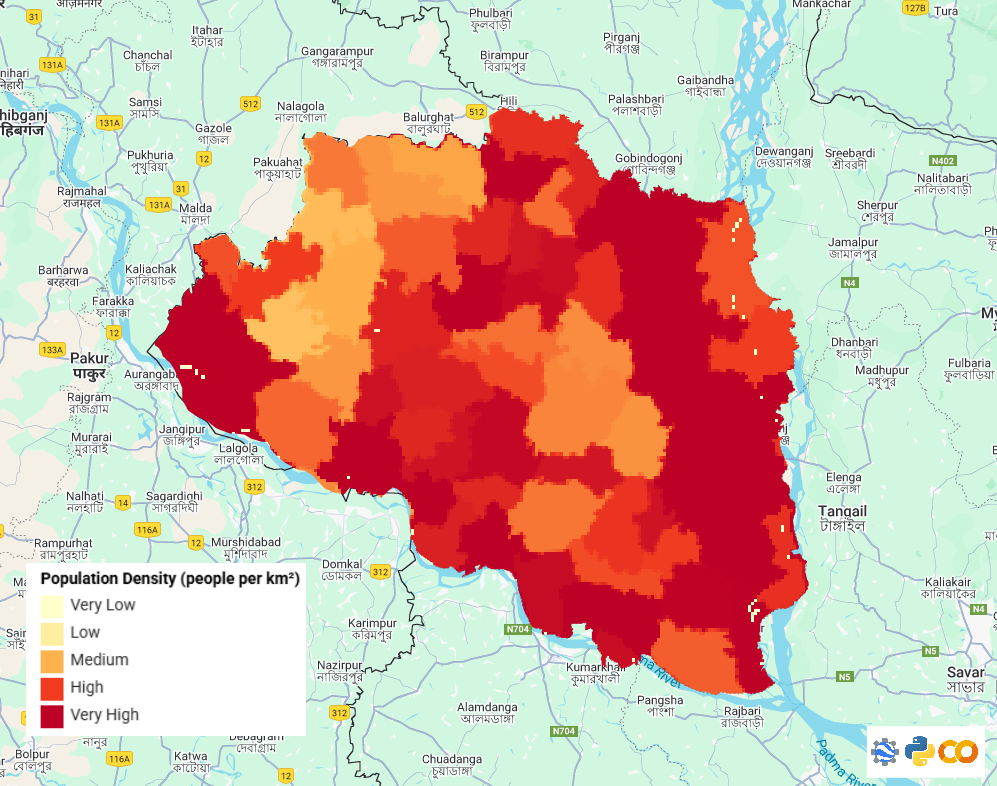
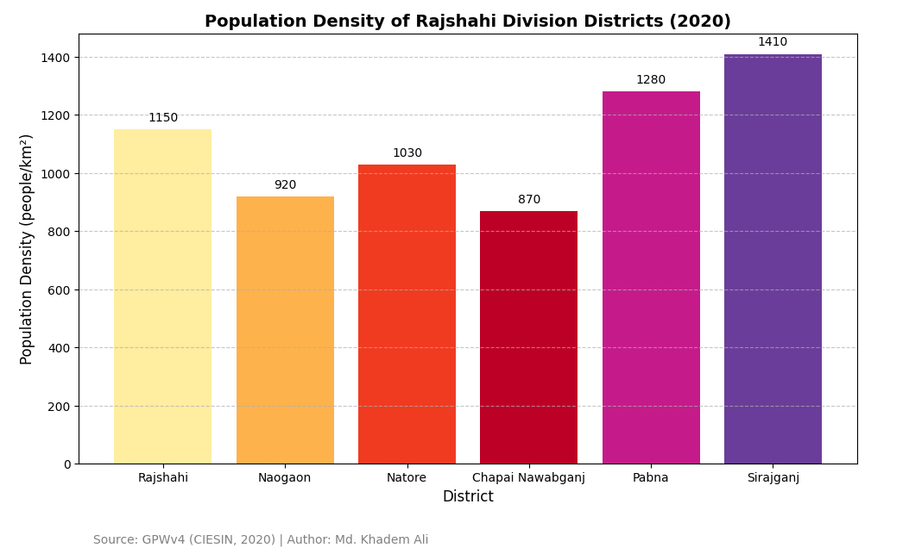

## Rajshahi Division Population Density Visualization

This repository contains a **population density analysis of Rajshahi Division, Bangladesh** using both **Google Earth Engine (GEE)** and **Python (matplotlib)**.  
The project provides **spatial visualization** and **district-wise comparison** of population density.

---

## Project Overview

- **Objective:** Visualize population density across Rajshahi Division and compare density among districts.  
- **Data Source:** [GPWv4 Population Density, CIESIN (2020)](https://sedac.ciesin.columbia.edu/data/collection/gpw-v4).  
- **Tools Used:**  
  - **Google Earth Engine (GEE)**: For spatial map and legend creation.  
  - **Python (matplotlib)**: For generating district-wise bar charts.  
  - **Google Colab (Optional)**: To run Python code without local installation.

---

## GEE Map

The map shows the **population density distribution** of Rajshahi Division.  

- High-density areas (urban centers) are colored in **red**.  
- Low-density areas (rural zones) are colored in **yellow**.  
- Includes a **color-coded legend** for population density (people/km²).  
 
**Source:** GPWv4 (CIESIN, 2020)  

---

## District-wise Bar Chart

This chart presents **population density per district** in Rajshahi Division.

- Each district has a **unique color**.  
- Values on top of bars show exact population density.  
- The chart complements the GEE map with a **quantitative comparison**.

**Author:** Khadem Ali  
**Source:** GPWv4 (CIESIN, 2020)  

© mdkhademali